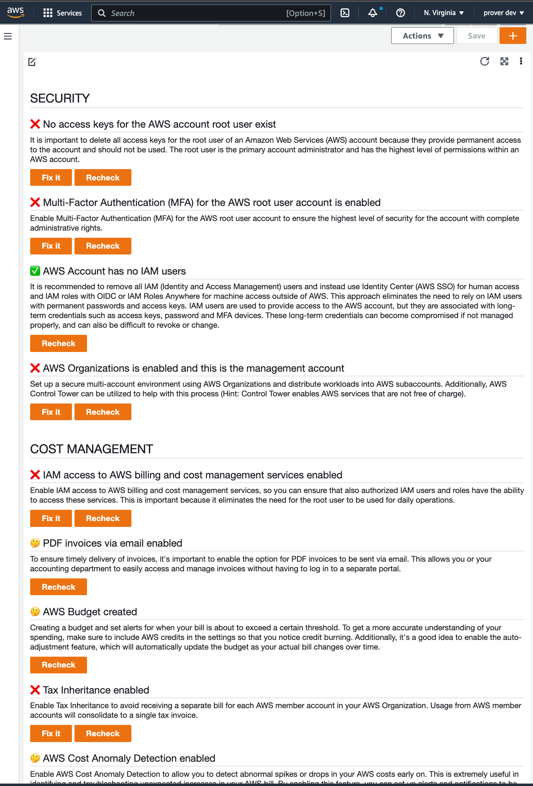
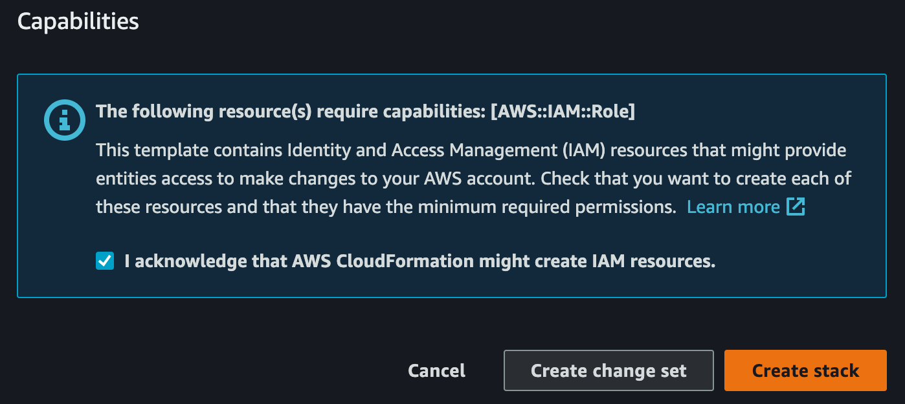

# aws-prober

aws-prober is an open-source tool for ensuring a secure and cost-aware AWS foundation, based on my now 14 years of AWS
experience and dozens of AWS setups.

This free tool runs in your AWS account and offers an interactive dashboard with guidance on how to mitigate any issues
that are detected, helping you to optimize your AWS environment.

The first release comes with the following checks:

### Security:

- No access keys for the AWS account root user exist
- Multi-Factor Authentication (MFA) for the AWS root user account is enabled
- AWS Account has no IAM users
- AWS Organizations is enabled and this is the management account

### Billing, Cost management and awareness:

- IAM access to AWS billing and cost management services enabled
- PDF invoices via email enabled
- AWS Budget created
- Tax Inheritance enabled
- AWS Cost Anomaly Detection enabled
- AWS Compute Optimizer enabled

## Installation

aws-prober is not an SaaS tool, but is installed directly into your AWS account, so you have complete control and
visibility.

1. **Make sure you are logged in as an Administrator (e.g. the root user, or an IAM user) to your AWS account.**
2. You install aws-prober via CloudFormation with this
   one-click-setup: [Launch aws-prober](https://us-east-1.console.aws.amazon.com/cloudformation/home?region=us-east-1#/stacks/quickcreate?stackName=aws-prober&templateURL=https://prober-releases.s3.amazonaws.com/latest/prober.template).
3. Scroll to the bottom, acknowledge that IAM resources are being created on your behalf. and press "Create
   stack"  .
4. The aws-prober CloudFormation stack takes 2-3 minutes to set up, after that a CloudWatch dashboard shows the status
   of the AWS account. Here's
   the [direct link to the CloudWatch dashboard in your AWS account](https://console.aws.amazon.com/cloudwatch/home?#dashboards:name=aws-prober)

**Note: Currently, aws-prober can only be installed into the `us-east-1` region.**

## Usage

Go to the [aws-prober CloudWatch dashboard in your AWS account](https://console.aws.amazon.com/cloudwatch/home?#dashboards:name=aws-prober)

Tou may have to confirm to run the aws-prober Lambda function. This is a security measure by the Cloudwatch service.

Now Read the through checks, and make the "red" ones "green" with the help of the linked resources.

## Uninstallation

You can seamlessly uninstall aws-prober: Delete the `aws-prober` CloudFormation stack. CloudFormation takes care of cleaning up all aws-prober resources.

## Commercial help and support

You can seamlessly request my commerical support via [AWS IQ](https://iq.aws.amazon.com/e/soenke).

## Known issues

- Some checks have dependencies, e.g. tax inheritance depends on IAM access to billing enabled. This is currently not directly reflected in the UI.
- aws-prober is currently focussed on checking the AWS management account for best practices. Some checks, though, such as "no IAM users", also make sense in member AWS accounts.

## FAQ

### How much does it cost?

aws-prober itself is free. It sets up some AWS resources, such as a CloudWatch dashboard, AWS Config Rules, and AWS Lambda functions. The current AWS free tier includes 3 free CloudWatch dashboards, and many AWS Lambda invocations. The installed AWS Config Rules incur a small fee, which is usually below one cent/$month.

It's also safe to uninstall aws-prober after checking and fixing the AWS account.

### How does it work?

prober utilizes the following AWS services and features:

- AWS Config Rules for checks and evaluation
- CloudWatch Dashboard as UI to display the checks and help
- CloudFormation for installation and updates
- Third party awsapilib for AWS features which are not exposed via API 

The AWS CDK is used for development.

## Does aws-prober work with existing AWS environments?
 Yes. aws-prober is designed to be safely deployed into new and existing AWS environments. Uninstalling aws-prober is also non-invasive.

### Does aws-prober automatically set up the best practices?

Currently, aws-prober is a detective tool which does not provide any automatic remediation or fixing of issues. It offers guidance on how to fix the issues by yourself.

### How does aws-prober compare to AWS Trusted Advisor and AWS Well-Architected?

aws-prober is meant to be a very foundational checker for AWS account best practices, while AWS Trusted Advisor and Well Architected operate more on the individual workload and resource level. 

### How does aws-prober compare to Landing Zones such as Control Tower?

aws-prober currently operates one level "above" Landing Zones. For example, it recommends to set up a multi-account AWS environment  with AWS Organizations and AWS Control Tower. aws-prober might also check Landing Zones for best practices in the future.

### Does aws-prober support automatic updates?

Currently, there are no automatic updates. You can update aws-prober via CloudFormation.

### Does aws-prober emit events, e.g. for ChatBots?

aws-prober utilizes AWS Config Rules, which emit EventBridge events on state change. Bots and monitoring solutions, such as AWS ChatBot or Systems Manager OpsCenter, can react to these events.

### Is there a commercial variant?

aws-prober is free and open-source. Currently, there is no commercial variant of aws-prober. You can request my individual support via [AWS IQ](https://iq.aws.amazon.com/e/soenke).